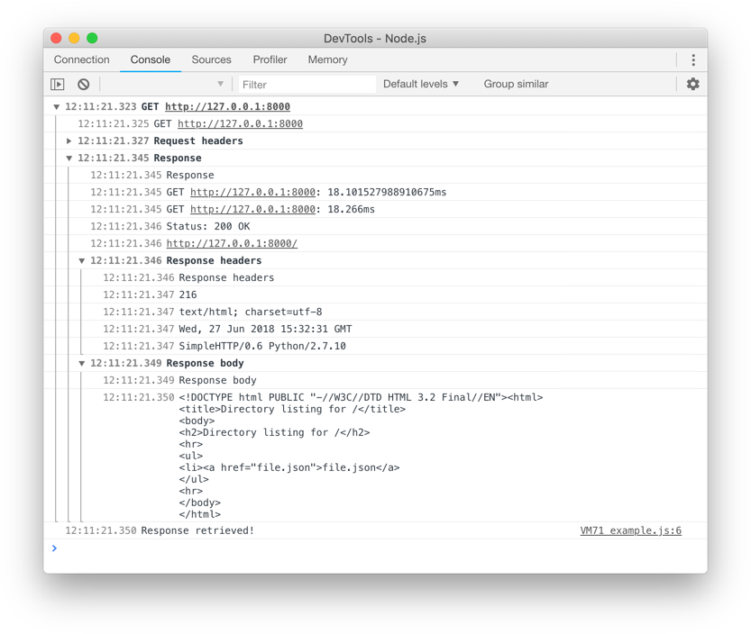

# fetch-logger
Logger for fetch (Work with any “fetch-compatible” function).
fetch logger will try by default to use the module `node-fetch`, but it's not a dependancy: You can use any other “fetch-compatible” function. You can specify any function compatible with fetch in first argument of your first call of fetch logger. After that, fetch logger should remember what function you already used.



## Example

NodeJS example using the module `node-fetch`.
```
const fetch = require('fetch-logger');

fetch('http://127.0.0.1:8000', {headers: {'X-Hello': 'world'}}).then((result) => {
	console.log('Response retrieved!');
});
```
